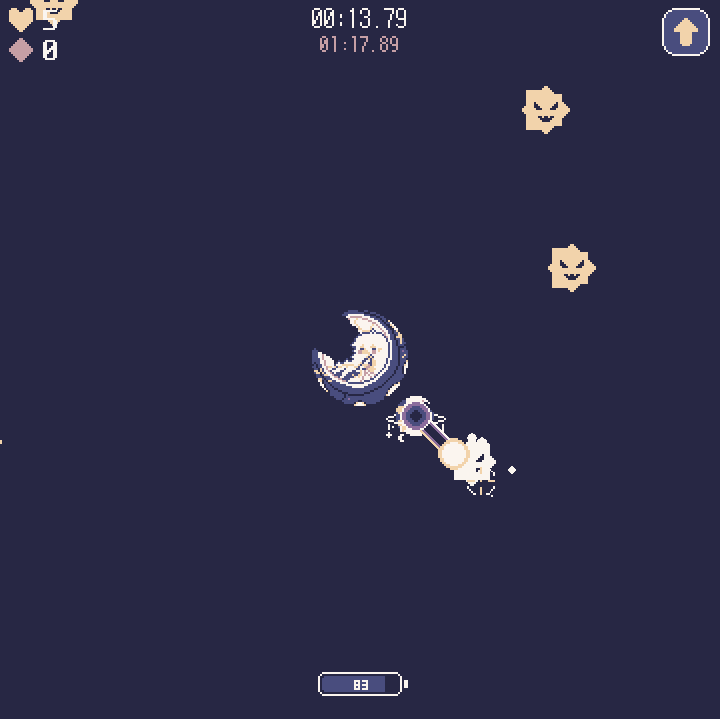

# 이드 디펜스

  

### [🎮 인터넷에서 바로 플레이하기!](https://hyeon-in.github.io/eddefense/)

### 다운로드
- [윈도우(Windows)](https://github.com/hyeon-in/Ed-Defense/releases/download/v1.0.0/EdDefense.zip)
- [안드로이드(Android)](https://github.com/hyeon-in/Ed-Defense/releases/download/v1.0.0/EdDefense.apk)

## 소개

**이드 디펜스**는 모바일 게임 "**트릭컬 리바이브**"의 비공식 팬게임으로, 사방에서 몰려오는 바이러스들로부터 나타가 이드를 보호하는 디펜스 게임입니다.

### 조작법:

- **데스크톱**:
  - 마우스 - 조준
  - 마우스 왼쪽 버튼 - 레이저 발사
- **모버알**:
  - 스와이프 - 조준 및 레이저 발사

## 개발 세부사항
- **게임 엔진:** Unity (2022.3.25f1)
- **개발 언어:** C#
- **게임 아트:** Aseprite
- **개발 기간:** 2024년 4월 20일 ~ 2024년 4월 26일(1주일)
- **역할:** 1인 개발

## 크레딧

### 게임 개발
- [Hyeonin(현인)](https://linktr.ee/hyeonin) - 프로그래밍 및 아트

### 원작 게임: 트릭컬 리바이브
- **개발사: (주)에피드게임즈**
  - [웹사이트](https://epidgames.com/)
- **관련 사이트:**
  - [웹사이트](https://trickcal.com/)
  - [유튜브](https://www.youtube.com/@epidgames6350)
  - [X(트위터)](https://twitter.com/Trickcal_Re)
  - [인스타그램]( https://www.instagram.com/trickcal.revive?igshid=YzAwZjE1ZTI0Zg%3D%3D)
  - [네이버 카페](https://cafe.naver.com/trickcal)
  - [네이버 라운지](https://game.naver.com/lounge/Trickcal/home)
- **다운로드:**
  - [Google Play Store](https://play.google.com/store/apps/details?id=com.epidgames.trickcalrevive)
  - [App Store]( https://apps.apple.com/kr/app/%ED%8A%B8%EB%A6%AD%EC%BB%AC-revive/id6443824730)

### 음악
- Nyan Nut
  - [유튜브](https://www.youtube.com/@NutNyan/)

## 참고
1. **본 게임은 (주)에피드게임즈 사의 모바일 게임 '트릭컬 리바이브'와는 전혀 관계가 없는 비공식 팬게임입니다.**
2. **본 게임은 어떠한 상업적 목적 없이 개인적인 창작 활동으로 제작되었습니다.**
3. **게임 제작에 있어 원작 게임 내의 어떠한 리소스도 사용되지 않았습니다.**
4. **본 게임은 (주)에피드게임즈 사에서 공개한 [트릭컬 리바이브 2차 창작물 가이드라인](https://epidgames.oqupie.com/portal/2399/article/50943)을 준수하여 제작되었습니다.**
